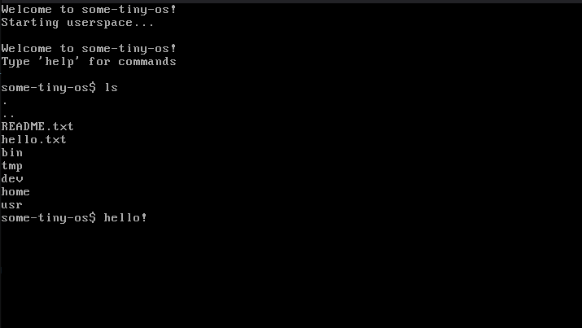

```
 ___  ___  _ __ ___   ___      | |_(_)_ __  _   _        ___  ___ 
/ __|/ _ \| '_ ` _ \ / _ \_____| __| | '_ \| | | |_____ / _ \/ __|
\__ \ (_) | | | | | |  __/_____| |_| | | | | |_| |_____| (_) \__ \
|___/\___/|_| |_| |_|\___|      \__|_|_| |_|\__, |      \___/|___/
                                            |___/  
Some small, open-source, Unix-like operating system
```
<p align="center">
 
</p>

**some-tiny-os** is a unix-like operating system that was made from scratch. has a custom kernel, custom libc known as ```some-libc``` and a custom filesystem. it currently supports x86_64 but in the future there might be a 32-bit version of the operating system.

# getting started
alright, before you can try out the operating system on a virtual machine, you need to install the following software:

* GCC
* NASM
* QEMU
* make

if you have linux you can type this into the terminal:

```bash
# debian/ubuntu
sudo apt install make, gcc, nasm, qemu-system-x86-64

# arch linux
sudo pacman -S qemu-system-x86_64 make gcc nasm
```
if you use windows you can use the windows subsystem for linux (wsl) to compile the operating system

anyways, after you installed all of the essential software, its time to compile the OS and run it inside of QEMU

```bash
git clone https://github.com/someguythat-thinkswithportals/some-tiny-os.git
cd some-tiny-os
make all
qemu-system-x86_64 some-tiny-os.img
```
alternatively you can do this to compile it and run it inside of QEMU

```bash
git clone https://github.com/someguythat-thinkswithportals/some-tiny-os.git
cd some-tiny-os
make run
```
## available make flags
```bash
make all # builds everything
make run # builds everything and runs in qemu
make run-serial # same thing as make run but it has serial stuff
make kernel # builds the kernel
make clean
```